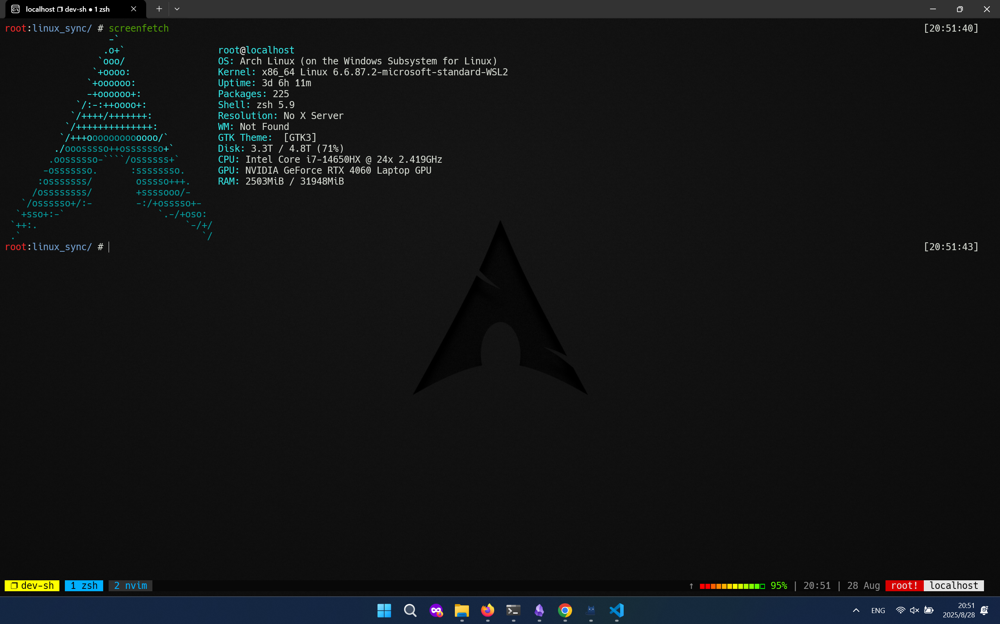
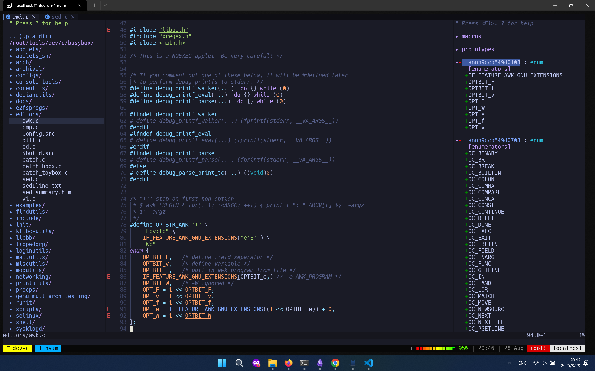

# Dark Arch


> [!Important] 利用 Tmux + Neovim 打造最强Linux开发环境。
> 本仓库仅记录具体安装命令，用于个人快速搭建环境，不涉及任何插件二开细节、工具原理、使用方式等解释，请自行辨别。

## 基本环境 - wsl2 + Arch
1. 安装`archlinux-xxx.wsl`文件：[https://mirrors.aliyun.com/archlinux/wsl/latest/?spm=a2c6h.25603864.0.0.3b896e31D6YFPc]
2. `wsl --install --from-file xxx.wsl`安装Arch

## Arch基本配置
1. 添加国内镜像：`sh -c 'echo -e "Server = https://mirrors.tuna.tsinghua.edu.cn/archlinux/\$repo/os/\$arch\nServer = https://mirrors.aliyun.com/archlinux/\$repo/os/\$arch\nServer = https://mirrors.ustc.edu.cn/archlinux/\$repo/os/\$arch\nServer = https://mirror.sjtu.edu.cn/archlinux/\$repo/os/\$arch" > /etc/pacman.d/mirrorlist'`
2. 更新系统：`pacman -Syu`
3. update repo: `pacman -Syy`
3. 安装基本工具：`pacman -S --needed base-devel git curl wget unzip zip gdb lib32-glibc lib32-gcc-libs net-tools openssh`
4. 安装常用工具：`pacman -S zsh fzf ripgrep fd jq bat vim neovim tmux proxychains-ng zoxide fontconfig nodejs universal-ctags nodejs npm`
5. `proxychains`添加代理：`nvim /etc/proxychains.conf`
6. 安装`ohmyzsh`:`proxychains sh -c "$(proxychains curl -fsSL https://raw.githubusercontent.com/ohmyzsh/ohmyzsh/master/tools/install.sh)"`
7. 修改`.zshrc`文件（参考该项目的`.zshrc`）
8. 安装`tpm`：`git clone https://github.com/tmux-plugins/tpm ~/.tmux/plugins/tpm`
9. 安装`oh-my-tmux`，随后修改`~/.config/tmux/tmux.conf.local`,参考项目文件`tmux.conf.local`
```sh
$ git clone --single-branch https://github.com/gpakosz/.tmux.git "/path/to/oh-my-tmux"
$ mkdir -p ~/.config/tmux
$ ln -s /path/to/oh-my-tmux/.tmux.conf ~/.config/tmux/tmux.conf
$ cp /path/to/oh-my-tmux/.tmux.conf.local ~/.config/tmux/tmux.conf.local
```
10. 开启全局代理进入`tmux`,自动安装插件

### 安装paru（只能用于非root环境）
```sh
# 创建新用户
useradd -m builduser
passwd builduser

# 添加用户到sudoer
usermod -aG wheel builduser
visudo # 去掉注释 %wheel ALL=(ALL:ALL) ALL
su builduser
cd

# 安装环境
proxychains curl --proto '=https' --tlsv1.2 -sSf https://sh.rustup.rs | sh

# 安装paru
proxychains git clone https://aur.archlinux.org/paru.git
cd paru
proxychains makepkg -s
su root
pacman -U /home/builduser/paru/paru-2.1.0-1-x86_64.pkg.tar.zst
```

### 安装NerdFont字体(wsl请用windows安装字体)
1. 克隆库 `proxychains git clone https://github.com/ryanoasis/nerd-fonts`
2. 安装字体: `cd nerd-fonts && chmod +x ./install.sh && ./install.sh Hack`
3. 刷新: `fc-cache -fv`

## Neovim
1. 安装`vim-plug`：`proxychains curl -fLo "${XDG_DATA_HOME:-$HOME/.local/share}"/nvim/site/autoload/plug.vim --create-dirs https://raw.githubusercontent.com/junegunn/vim-plug/master/plug.vim`
2. 将其他`nvim/`下所有文件复制至`~/.config/nvim/`文件夹中
3. 重启nvim并使用`:PlugInstall`安装插件
4. 安装`nvim-lspconfig`:`proxychains git clone https://github.com/neovim/nvim-lspconfig ~/.config/nvim/pack/nvim/start/nvim-lspconfig`
5. change `.config/nvim/lua/opts.lua`
6. change `.config/nvim/lua/keys.lua`

### Neovim-markdown
1. `MasonInstall marksman`

### Neovim-rust
1. 使用`mason`安装：`:MasonInstall rust-analyzer codelldb`

### Neovim-python
1. install pyenv: `proxychains curl -fsSL https://pyenv.run | proxychains bash`
2. add pyenv startup env: 
```sh
echo 'export PYENV_ROOT="$HOME/.pyenv"' >> ~/.zshrc
echo '[[ -d $PYENV_ROOT/bin ]] && export PATH="$PYENV_ROOT/bin:$PATH"' >> ~/.zshrc
echo 'eval "$(pyenv init - zsh)"' >> ~/.zshrc
```
3. `source ~/.zshrc`
4. `proxychains pyenv install 3.13.6`
5. `pyenv global 3.13.6`
6. mason install lsp: `:MasonInstall mypy debugpy python-lsp-server`

### Neovim-lua
1. mason install lsp: `:MasonInstall lua-language-server`

### Neovim-asm
1. `proxychains wget --secure-protocol=tlsv1_2 --no-check-certificate https://github.com/bergercookie/asm-lsp/releases/download/v0.10.0/asm-lsp-x86_64-unknown-linux-gnu.tar.gz`
2. `tar -zxvf asm-lsp-x86_64-unknown-linux-gnu.tar.gz`
3. add asm-lsp in $PATH

### Neovim-java
1. `curl -s "https://get.sdkman.io" | bash`
2. `source "$HOME/.sdkman/bin/sdkman-init.sh"`
3. `sdk use java 21.0.8-amzn`
4. `sdk default java 21.0.8-amzn`

### Neovim-dotnet
1. `pacman -S dotnet-sdk`
2. `dotnet tool install -g EasyDotnet`
